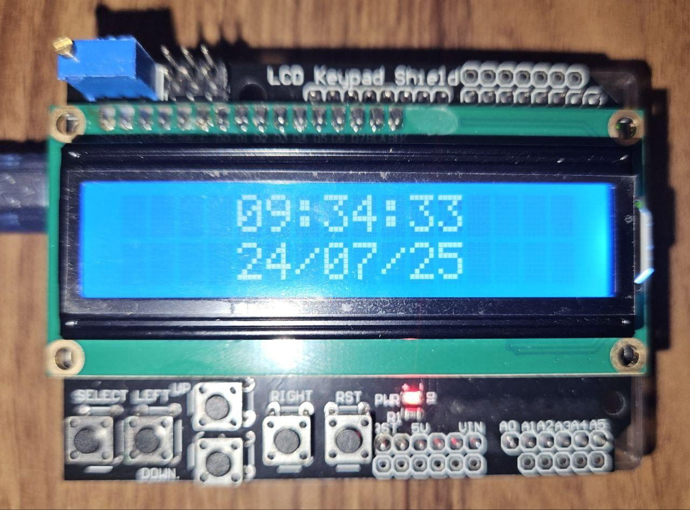

- Built with the Arduino framework
- No pin actions are implemented other than the ones for the LCD

Features:
- Date
- Time (variation on numbers of days in different months is not implemented)
- Timer
- Chronometer
- Alarm difined by start time, number of repetitions and interval of repetition in minutes

